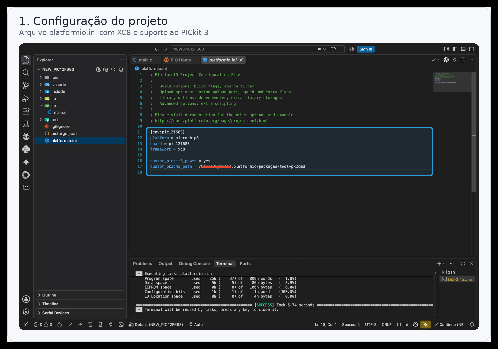
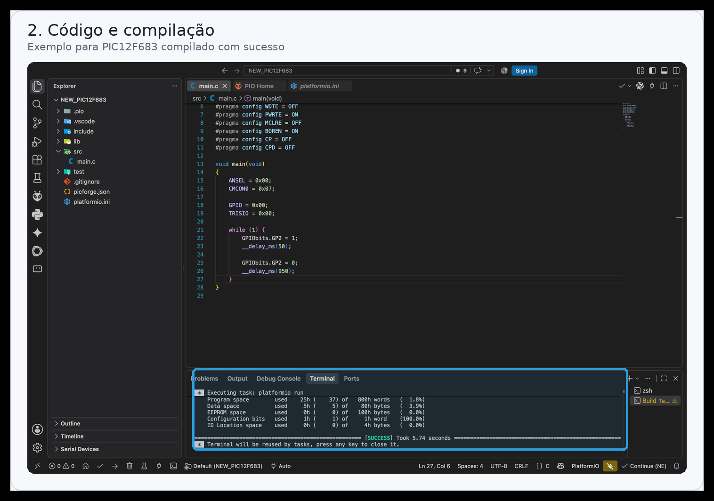

## Configuração do projeto

Edite o arquivo `platformio.ini` com a plataforma, o microcontrolador e o framework XC8:

  

## Primeiro código e compilação

Crie o arquivo `src/main.c` e execute a compilação pelo PlatformIO. Ao final, o terminal deve apresentar `SUCCESS`:

  

